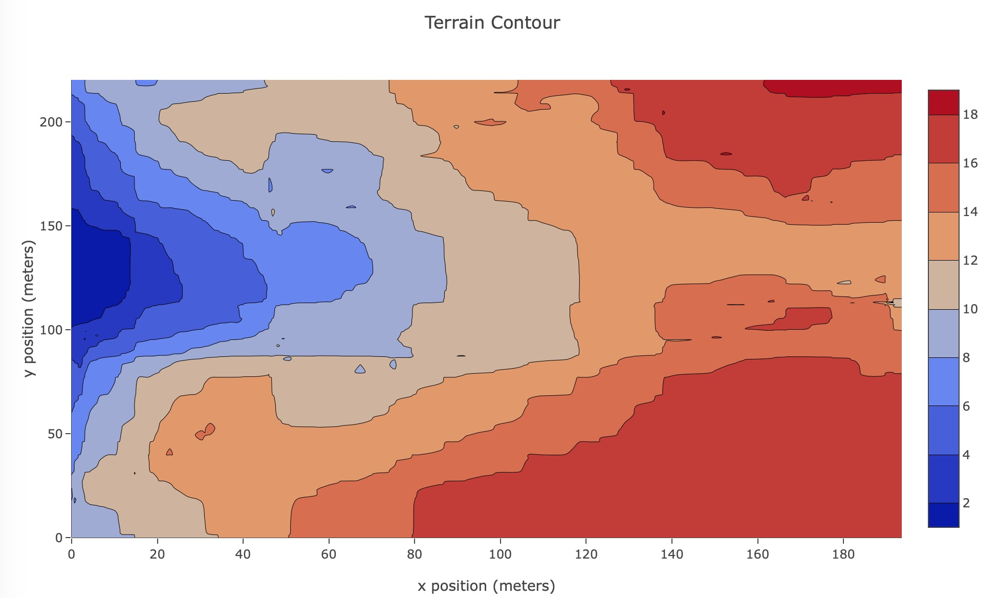
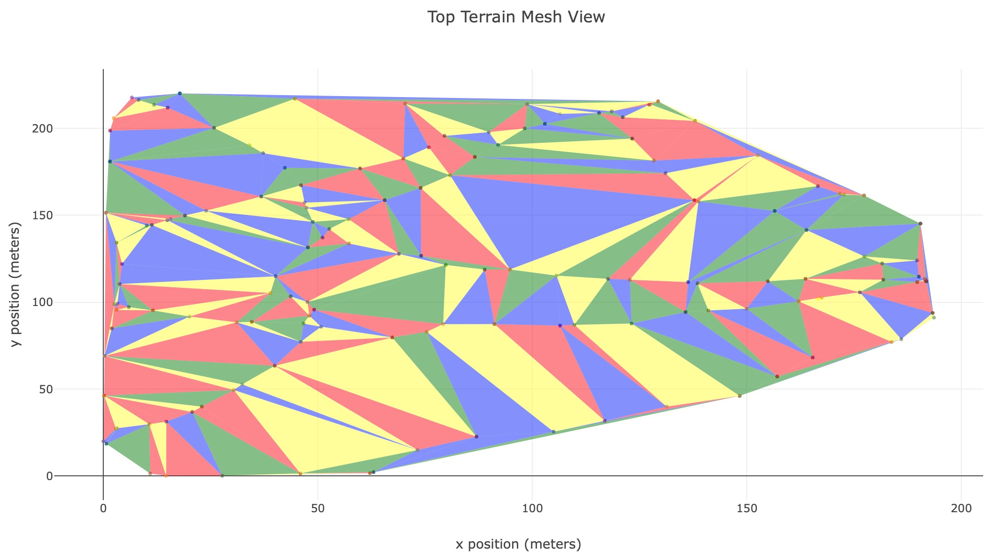
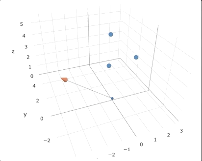

# Volume Calculations for Digital Elevation Models in Python (**volpy**)

The purpose of this Python project is to provide the means of calculating volumes out of a Digital Elevation Model ([DEM](https://en.wikipedia.org/wiki/Digital_elevation_model)) represented by Triangulated Irregular Network ([TIN](https://en.wikipedia.org/wiki/Triangulated_irregular_network)).

Its main goal is to provide sufficiently accurate volume estimates out of terrain surveys for an area of construction work where ground leveling is required prior to the actual construction activity.




# Installation
```bash
$ pip install volpy
```

# Examples

## Quick demo

```Python
import volpy as vp
vp.demo()
```

## Simple use case

```Python
import volpy as vp
survey = vp.load_survey('survey_data.csv')
mesh = vp.terrain_mesh(survey)
survey.get_bounds()
> 'x=250.13, y=402.14, z=11.54'
### Survey plots
plots = vp.terrain_plots(survey)
plots.scatter3d()
plots.contour()
plots.profile()
plots.mesh_plot()
vol_curves = mesh.get_volume_curves(step=1.0)
mesh.plot_curves(vol_curves)
```

By default, volpy applies its calculations on a [Cartesian Coordinate System](https://en.wikipedia.org/wiki/Cartesian_coordinate_system). If you are working with survey data obtained from a [GPS](https://en.wikipedia.org/wiki/Global_Positioning_System), its points are likely represented in a [Geographic Coordinate System](https://en.wikipedia.org/wiki/Geographic_coordinate_system). In order to convert it, use the following modifier when loading the data.

```Python
>>> vp.load_survey('survey_data.csv', coordinates=vp.Coordinates.GPS)
```

# Key Definitions

## Terrain survey
A process by which points are collected from a terrain of interest in order to form a representation of it.

## Ground leveling
In the context of construction, ground leveling is a process by which a given terrain can be re-shaped to a desired projected shape, slope or level. It is usually carried out by the use of heavy machinery to move terrain materials either from the inside the terrain (redistribution of soil) or by using material from the outside.

## Cut/Fill volumes
In the context of ground leveling, cut volume refers to terrain material that needs to be **removed** in order to contribute to re-shape the terrain a new desired state. It is about removing excess. Conversely, fill volumes represent material that needs to be **added** to the terrain towards achieving this same goal. In practical terms, it is about covering the holes in the terrain.

# Volume Calculation Method

During most undergrad studies people are taught how to calculate integrals on a number of different equations. But the real world doesn't give us equations, we need to come up with the equations to model it. This was one of the most delightful pieces of this project: translating a set of points in space into equations and applying basic concepts of [linear algebra](https://en.wikipedia.org/wiki/Linear_algebra) and [integral calculus](https://en.wikipedia.org/wiki/Integral) to them to obtain volumes and [cut/fill](https://en.wikipedia.org/wiki/Cut_and_fill) curves that can be put to practical use in construction work involving [earthworks](https://en.wikipedia.org/wiki/Earthworks_(engineering)).

## In a Nutshell
1. From points to a triangles.
2. From triangles to plane equations.
3. From triangles and planes to a sum of volumes.

## Step 1: From points to triangles
The sequence of points in 3D space represented each by an `(x,y,z)` triplet is grouped in a mesh grid using [Delaunay triangulation](https://en.wikipedia.org/wiki/Delaunay_triangulation) in the `(x,y)` coordinates. This process outputs a collection of points grouped in 3 sets of 3d coordinates, each representing a triangular plane in 3d space:  
`[(xA,yA,zA), (xB,yB,zB), (xC,yC,zC)] = [A,B,C]`  

This is what it looks like when viewed from the top:  


## Step 2: From triangles to plane equations
The plane equation `z=f(x,y)` representing is obtained for each group of 3 distinct points (triangles) in 3d space by applying some basic linear algebra. Given the previous collection of points `[A, B, C]` in the cartesian system:  
1. Vector AB and BC are determined using each of their individual coordinates.
2. The [cross product](https://en.wikipedia.org/wiki/Cross_product) AB x BC generates a perpendicular vector represented by numerical constants `(p,q,r)`.
3. Finally the corresponding plane equation is given by:  
> p*(x-xo) + q*(y-yo) + r*(z-zo) = 0  
where `(xo,yo,zo)` can be any one of the 3 A, B or C points from the plane.

In the GIF below, the ABC triangle is represented by the blue points and the orthonormal vector `(p, q, r)` is represented by the blue line with an orange tip.



## Step 3: From triangles and planes to a sum of volumes
Given the plane equation, we can isolate z and obtain a `z=f(x,y)` function on top of which the double integral is applied in order to calculate the volume beneath the triangular plane down until the plane perpendicular to the XY axis that passes by the lowest elevation coordinate (z) of the survey.  

The volume of each individual triangle is obtained by the sum of 2 double integrals. So for a triangle with vertices ABC and its plane determined by `z=f(x,y)` the double integral limits for a single triangular area are determined as follows:  
  

## From GPS to Cartesian Coordinates.
In the event of the [terrain survey](###-Terrain-survey) being executed thru a GPS device (the most common case) an extra step is required prior to applying the volume calculation: [map projection](https://en.wikipedia.org/wiki/Map_projection).

For the purpose of this project the [Universal Traverse Mercator](https://en.wikipedia.org/wiki/Universal_Transverse_Mercator_coordinate_system) was used to convert from GPS coordinates (latitude, longitude, elevation) to a Cartesian coordinate system which is expected by the algorithm in [step 1](###-Step-1:-From-points-to-triangles).
